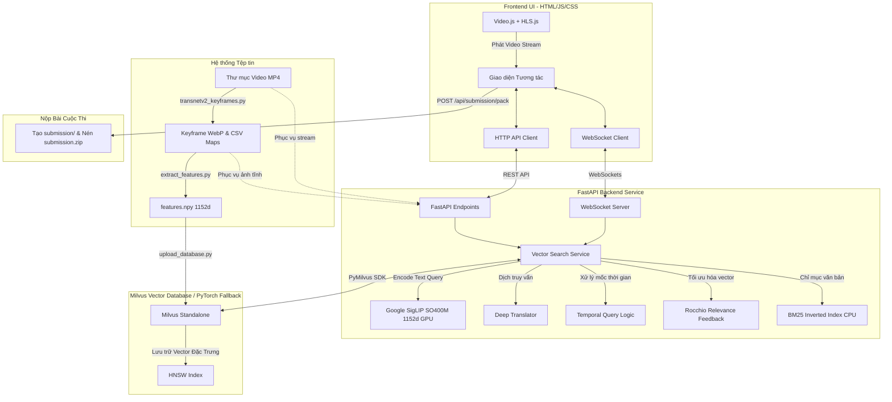

# Video Retrieval System — code-c-a-Long 🚀

Hệ thống tìm kiếm hình ảnh & khoảnh khắc video thông minh dựa trên mô tả ngữ nghĩa (Text-to-Video Retrieval), tối ưu hóa cho cuộc thi **AI City Challenge (AIC 2026)**.

Dự án cung cấp một giải pháp end-to-end hiệu năng cao: từ khâu trích xuất khung hình tiêu biểu (Keyframe bằng TransNetV2), mã hóa đặc trưng vector (Google SigLIP SO400M 1152d), lưu trữ tìm kiếm trên Cơ sở dữ liệu Vector (Milvus / PyTorch CUDA) cho đến giao diện người dùng tương tác thời gian thực, tích hợp Trình quản lý Gói Nộp Bài & Tự động nén ZIP theo chuẩn BTC.

> **Tối ưu hóa cao cấp cho phần cứng:**
> - **Hệ điều hành:** Windows 11 (Pathlib an toàn, xử lý bất đồng bộ & đa tiến trình)
> - **Cấu hình phần cứng:** Tối ưu hóa cho cấu hình **16 GB RAM**, GPU NVIDIA **6 GB VRAM** (hỗ trợ CUDA PyTorch, FP16 Autocast).
> - **Mô hình thị giác SOTA:** OpenCLIP `ViT-SO400M-14-SigLIP-384` (Google, 1152 chiều, Pretrained WebLI).
> - **Bộ tìm kiếm văn bản & lời thoại:** BM25 Inverted Index trên CPU RAM (< 2ms, 0 MB VRAM).
> - **Thuật toán tinh chỉnh phản hồi:** Rocchio Relevance Feedback (Alt + R).
> - **Batch Submission Package Manager:** Xuất CSV và nén `submission.zip` chuẩn 100% quy định BTC.

---

## 🏗️ Kiến Trúc Hệ Thống (System Architecture)

---

## 🛠️ Chi Tiết Công Nghệ & Công Cụ

| Thành phần | Công nghệ / Thư viện | Vai trò & Đặc điểm |
| :--- | :--- | :--- |
| **Deep Learning** | `torch` >= 2.0.0, `torchvision` | Khung xử lý Tensor & chạy mô hình trên card đồ họa NVIDIA CUDA. |
| **Vision SOTA** | `open_clip_torch` (`ViT-SO400M-14-SigLIP-384`) | Mô hình Top-1 SOTA ánh xạ ảnh và văn bản vào không gian 1152 chiều. |
| **Text & Speech Index** | `BM25 Inverted Index` | Tra cứu tức thì 137k lời thoại ASR và 17k nhãn OCR trong < 2ms. |
| **Keyframe Cut** | `TransNetV2` | Nhận diện cảnh quay chính xác, loại bỏ 70% ảnh trùng lặp. |
| **Vector DB** | `Milvus` v2.6.2 (HNSW) / PyTorch CUDA | Tìm kiếm vector tương đồng trên quy mô hàng trăm nghìn bản ghi. |
| **Translation** | `deep-translator` | Tự động phát hiện và dịch câu truy vấn tiếng Việt sang tiếng Anh. |
| **Backend Web** | `fastapi` >= 0.110.0 | Framework Web bất đồng bộ (async), hiệu năng cao. |
| **Frontend Core** | HTML5, CSS3 Cyberpunk Vanilla | Giao diện thuần nhẹ, tải trang tức thì, hỗ trợ phím tắt chuyên nghiệp. |

---

## 📖 Hướng Dẫn Sử Dụng
Xem tài liệu hướng dẫn đầy đủ tại: **[HUONG_DAN.md](HUONG_DAN.md)**
