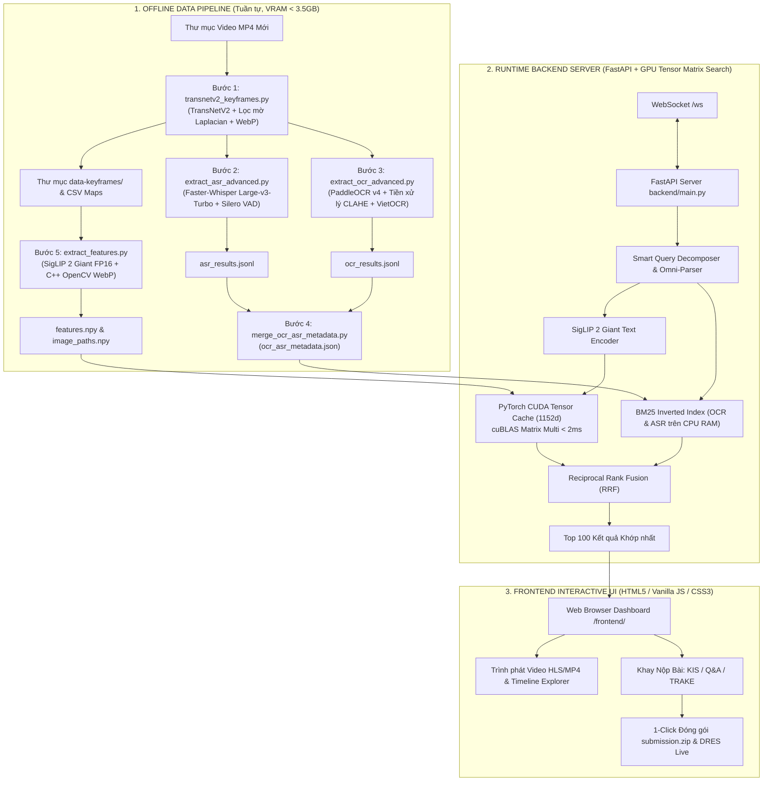

# Hệ Thống Truy Vấn Video Đa Phương Thức (Multimodal Video Retrieval System) 🚀
**Codebase:** `code-c-a-Long` | **Tối ưu cho:** Cuộc thi Video Retrieval / AI City Challenge (AIC 2026) / VBS

---

## 📌 1. TỔNG QUAN HỆ THỐNG (SYSTEM OVERVIEW)

Hệ thống cung cấp giải pháp tìm kiếm khoảnh khắc video (Video Moment Retrieval) toàn diện và hiệu năng cao từ văn bản tự nhiên, sử dụng các mô hình AI chuẩn SOTA mới nhất:
* **Visual Backbone (Thị giác):** Google OpenCLIP `ViT-gopt-16-SigLIP2-384` (**Google SigLIP 2 Giant** - Mô hình thị giác ~1 tỷ tham số SOTA đỉnh cao, vector 1152 chiều, Pretrained WebLI, FP16 CUDA Tensor Cores).
* **Smart Query Decomposer & Omni-Parser:** Bộ phân rã câu hỏi thông minh chạy trên CPU RAM (0 MB VRAM, < 1ms), tự động tách chuỗi sự kiện đa thời gian (TRAKE), trích xuất từ khóa chữ viết (OCR), nhận diện lời thoại (ASR), và làm giàu mô tả thị giác song ngữ (Vietnamese $\leftrightarrow$ English).
* **ASR Backbone (Âm thanh & Lời thoại):** `Faster-Whisper Large-v3-Turbo` tích hợp **Silero VAD (Voice Activity Detection)** chạy trên CUDA Tensor Cores (nhanh gấp 4 lần, lọc sạch 100% tạp âm/nhạc nền, Batched Inference).
* **OCR Backbone (Văn bản trên màn hình):** `PaddleOCR PP-OCRv4` + `VietOCR` kết hợp bộ tiền xử lý tăng tương phản thích ứng **CLAHE (Contrast Limited Adaptive Histogram Equalization)** bắt trọn biển số, logo và phụ đề mờ.
* **Keyframe Extraction (Trích xuất thích ứng):** `TransNetV2` chia shot tự động + Bộ lọc mờ **Laplacian Variance** ($\text{Var} \ge 95.0$) + Bộ lọc ánh sáng LAB, tự động chọn frame nét nhất trong từng phân đoạn.
* **Hybrid Search & Fusion Engine:** Bộ tìm kiếm kết hợp **Reciprocal Rank Fusion (RRF)** dung hợp điểm số giữa Dense Vector Search (GPU CUDA cuBLAS $< 2\text{ms}$) và Sparse Lexical Search (BM25 Inverted Index trên CPU RAM $< 1\text{ms}$) với thời gian phản hồi siêu tốc ($< 5\text{ms}$).
* **Giao diện thi đấu & Quản lý nộp bài:** Web UI Cyberpunk hỗ trợ phím tắt thần tốc, chế độ tìm kiếm **KIS (Mô tả đơn)**, **Q&A** và **TRAKE (Chuỗi sự kiện theo thời gian)**, đóng gói `submission.zip` 1-click chuẩn 100% quy định BTC (hỗ trợ cả 3 dạng bài KIS, Q&A, TRAKE).

---

## 🏛️ 2. KIẾN TRÚC HỆ THỐNG (SYSTEM ARCHITECTURE)



---

## ⚙️ 3. DANH MỤC MÔ HÌNH VÀ CÔNG NGHỆ CHÍNH

| Thành phần | Mô hình / Công nghệ | Vai trò & Đặc điểm vượt trội |
| :--- | :--- | :--- |
| **Visual Backbone** | `Google SigLIP 2 Giant` (`ViT-gopt-16-SigLIP2-384`) | Mô hình thị giác ~1 tỷ tham số Vision-Language SOTA, vector 1152 chiều, FP16 Tensor Cores. |
| **Smart Omni-Parser** | `SmartQueryDecomposer` (CPU NLP) | Bóc tách tự động chuỗi thời gian TRAKE, từ khóa OCR, lời thoại ASR và mô tả thị giác song ngữ (0 MB VRAM, $< 1\text{ms}$). |
| **ASR (Speech-to-Text)** | `Faster-Whisper Large-v3-Turbo` + `Silero VAD` | Nhận diện tiếng Việt chuẩn xác từng mili-giây, lọc sạch 100% tiếng ồn/nhạc nền, tốc độ siêu nhanh. |
| **OCR (Text-on-Screen)** | `PaddleOCR PP-OCRv4` + `VietOCR` + `CLAHE` | Cân bằng sáng thích ứng làm rõ chữ mờ/cháy sáng; nhận diện biển số xe, tên đường, banner. |
| **Keyframe Selection** | `TransNetV2` + `Laplacian Variance Filter` | Tự động phát hiện chuyển cảnh, quét lân cận $\pm 3$ frames để chọn khung hình nét nhất ($\text{Var} \ge 95.0$). |
| **Hybrid Search & Fusion** | `Reciprocal Rank Fusion (RRF)` | Dung hợp điểm số chuẩn xác: $RRF(d) = \frac{1.00}{60 + \text{Rank}_{\text{visual}}} + \frac{1.15}{60 + \text{Rank}_{\text{ocr}}} + \frac{1.10}{60 + \text{Rank}_{\text{asr}}}$. |
| **Vector Search Engine** | `PyTorch CUDA Tensor Matrix Search` | Nhân ma trận trực tiếp trên GPU CUDA (RTX 3050), thời gian truy vấn $< 2\text{ms}$. |
| **Interactive Feedback** | `Rocchio Relevance Feedback` (`Alt + R`) | AI tái định vị vector trọng tâm dựa trên các ảnh thí sinh đã chọn để gom toàn bộ góc quay liên quan. |

---

## 💻 4. YÊU CẦU PHẦN CỨNG (SYSTEM PROFILE)

* **Hệ điều hành:** Windows 10 / 11 hoặc Ubuntu Linux.
* **CPU:** AMD Ryzen 7 / Intel Core i7.
* **RAM:** 16 GB RAM (hệ thống được tối ưu chỉ tiêu thụ $\sim 4.5\text{GB RAM}$ khi indexing, $\sim 2.5\text{GB RAM}$ runtime).
* **GPU:** NVIDIA GeForce RTX 3050 (6GB VRAM) hoặc cao hơn. Mức chiếm dụng VRAM chỉ $\sim 3.0 - 3.2\text{GB VRAM}$ (an toàn $100\%$, không bao giờ OOM).

---

## 🚀 5. HƯỚNG DẪN VẬN HÀNH TOÀN DIỆN

### A. Kích hoạt môi trường
Mở **Anaconda Prompt (Miniconda3)**:
```cmd
conda activate video_ai
cd /d D:\code-c-a-Long
```

---

### B. Quy trình nạp tập Video mới (Master Offline Indexing Pipeline)
Khi nhận được tập video mới từ Ban tổ chức, bạn chỉ cần chạy **1 lệnh duy nhất** để tự động thực hiện tuần tự toàn bộ 5 bước:

```cmd
python data_pipeline/run_master_offline_pipeline.py --videos-dir "D:/thu_muc_video_moi"
```

*Các tham số tùy chọn nếu cần:*
* `--videos-dir`: Đường dẫn thư mục chứa video gốc `.mp4` (*bắt buộc*).
* `--skip-keyframes`: Bỏ qua bước trích xuất keyframe nếu đã chạy trước đó.
* `--skip-asr`: Bỏ qua bước ASR nếu đã chạy trước đó.
* `--skip-ocr`: Bỏ qua bước OCR nếu đã chạy trước đó.

---

### C. Khởi động Web Server & Vào phòng thi
Sau khi nạp xong dữ liệu, khởi chạy Backend:
```cmd
python -m uvicorn backend.main:app --host 0.0.0.0 --port 8000
```
Mở trình duyệt Web tại: 👉 **`http://localhost:8000/frontend/`**

---

## ⌨️ 6. BẢNG PHÍM TẮT THẦN TỐC (KEYBOARD SHORTCUTS)

| Phím tắt | Thao tác | Mô tả chi tiết |
| :--- | :--- | :--- |
| **`Enter`** | **Tìm kiếm** | Thực thi tìm kiếm câu truy vấn đang gõ (trong ô KIS, QA hoặc TRAKE). |
| **`Chuột giữa`** / **`[+]`** | **Chọn ảnh** | Thêm ngay khung hình vào Khay Nộp bài. |
| **`Alt + A`** | **Bật / Tắt Khay** | Ẩn/hiện thanh công cụ chọn ảnh bên phải. |
| **`Alt + R`** | **Tinh chỉnh (Refine)** | AI gom toàn bộ các góc quay cùng sự kiện lên hàng đầu (Rocchio Feedback). |
| **`Alt + S`** | **Lưu Query** | Lưu câu truy vấn hiện tại vào Gói Bài Thi. |
| **`Ctrl + S`** / **`Alt + P`** | **Gói Bài & Nén ZIP** | Mở Bảng Quản Lý & Nén `submission.zip` 1-click chuẩn 100% BTC. |
| **`Ctrl + Q`** | **Làm mới ô nhập** | Xóa nhanh câu query để gõ câu mới. |
| **`Ctrl + I`** | **Tìm kiếm OCR** | Mở ô tìm kiếm chữ viết xuất hiện trên video. |
| **`Ctrl + K`** | **Tìm kiếm ASR** | Mở ô tìm kiếm giọng nói / lời thoại âm thanh trong video. |
| **`Alt + C`** / **`Alt + X`** | **Xóa ảnh khay** | Làm trống Khay Nộp để làm câu tiếp theo. |
| **`Esc`** | **Đóng cửa sổ** | Đóng trình phát video, Timeline Explorer hoặc các modal xem trước. |

---

## 📦 7. CẤU TRÚC THƯ MỤC DỰ ÁN (PROJECT STRUCTURE)

```
d:\code-c-a-Long/
├── backend/
│   ├── main.py                  # FastAPI Server, WebSocket /ws, RRF Hybrid Search Engine
│   ├── smart_query_decomposer.py# Bộ phân rã câu hỏi thông minh NLP & Auto TRAKE
│   ├── config.json              # File cấu hình Server, GPU Tensor & Thresholds
│   ├── requirements.txt         # Danh sách thư viện Python
│   └── dres_openapi.json        # Định nghĩa OpenAPI DRES Server
├── frontend/
│   ├── index.html               # Giao diện thi đấu Cyberpunk Dashboard
│   └── src/scripts/             # Toàn bộ script xử lý UI, WebSocket, Video Player, Submission
├── data_pipeline/
│   ├── run_master_offline_pipeline.py  # Master Runner tự động 5 bước Offline Indexing
│   ├── transnetv2_keyframes.py         # Trích xuất keyframe thích ứng + Lọc mờ Laplacian
│   ├── extract_asr_advanced.py         # Trích xuất ASR Faster-Whisper Large-v3-Turbo + VAD
│   ├── extract_ocr_advanced.py         # Trích xuất OCR PaddleOCR v4 + Tiền xử lý CLAHE + VietOCR
│   ├── merge_ocr_asr_metadata.py       # Đồng bộ và gộp Metadata OCR & ASR
│   ├── extract_features.py             # Trích xuất Vector Google SigLIP 2 Giant 1152d (FP16)
│   └── pack_submission.py              # Đóng gói và kiểm tra tính hợp lệ file submission.zip
├── data-keyframes/              # Thư mục lưu keyframes trích xuất (.webp) và maps CSV
├── features.npy                 # Tensor đặc trưng vector (~166k x 1152d)
├── image_paths.npy              # Danh sách đường dẫn keyframe tương ứng
├── ocr_asr_metadata.json        # Cơ sở dữ liệu văn bản OCR & ASR
├── submission/                  # Thư mục chứa các file query-X.csv bài thi
├── docs/                        # Thư mục tài liệu kỹ thuật & quy định cuộc thi
├── HUONG_DAN.md                 # Cẩm nang hướng dẫn thao tác thi đấu chi tiết
└── README.md                    # Tài liệu tổng quan kiến trúc và kỹ thuật hệ thống
```

---

## 🏆 8. CHIẾN THUẬT NỘP BÀI TỐI ƯU ĐIỂM SỐ (MRR & TOP RANK)

1. **Dạng bài KIS (`query-X-kis.csv`):**
   * Định dạng: `<video_name>,<frame_id>`.
   * Gõ mô tả ở tab **`KIS`** $\to$ Chọn **1 đến 3 frame chuẩn xác nhất** bằng mắt $\to$ Bấm **`Alt + S`**.
2. **Dạng bài Q&A (`query-X-qa.csv`):**
   * Định dạng: `<video_name>,<frame_id>,"<answer>"`.
   * Gõ mô tả để tìm đúng đoạn video $\to$ Mở video lên xem khoảnh khắc để tìm câu trả lời $\to$ Chuyển khay nộp sang tab **`Q&A`** và điền đáp án $\to$ Bấm **`Alt + S`**.
3. **Dạng bài TRAKE (`query-X-trake.csv`):**
   * Định dạng: `<video_name>,<frame_1>,<frame_2>,...,<frame_N>`.
   * Gõ mô tả chuỗi sự kiện hoặc dán cả câu vào ô tìm kiếm (AI tự tách các Stage) $\to$ Chọn chuỗi frame đúng thứ tự thời gian trong cùng 1 video $\to$ Bấm **`Alt + S`**.
4. **Nén file nộp bài:**
   * Bấm **`Ctrl + S`** (hoặc `Alt + P`) $\to$ Bấm **`NÉN & TẠO FILE SUBMISSION.ZIP`** $\to$ Nộp trực tiếp file `D:\code-c-a-Long\submission.zip` lên cổng thi đấu của BTC!

---

## 📖 Hướng Dẫn Sử Dụng Chi Tiết
Xem toàn bộ hướng dẫn thao tác thi đấu tại: **[HUONG_DAN.md](HUONG_DAN.md)**
