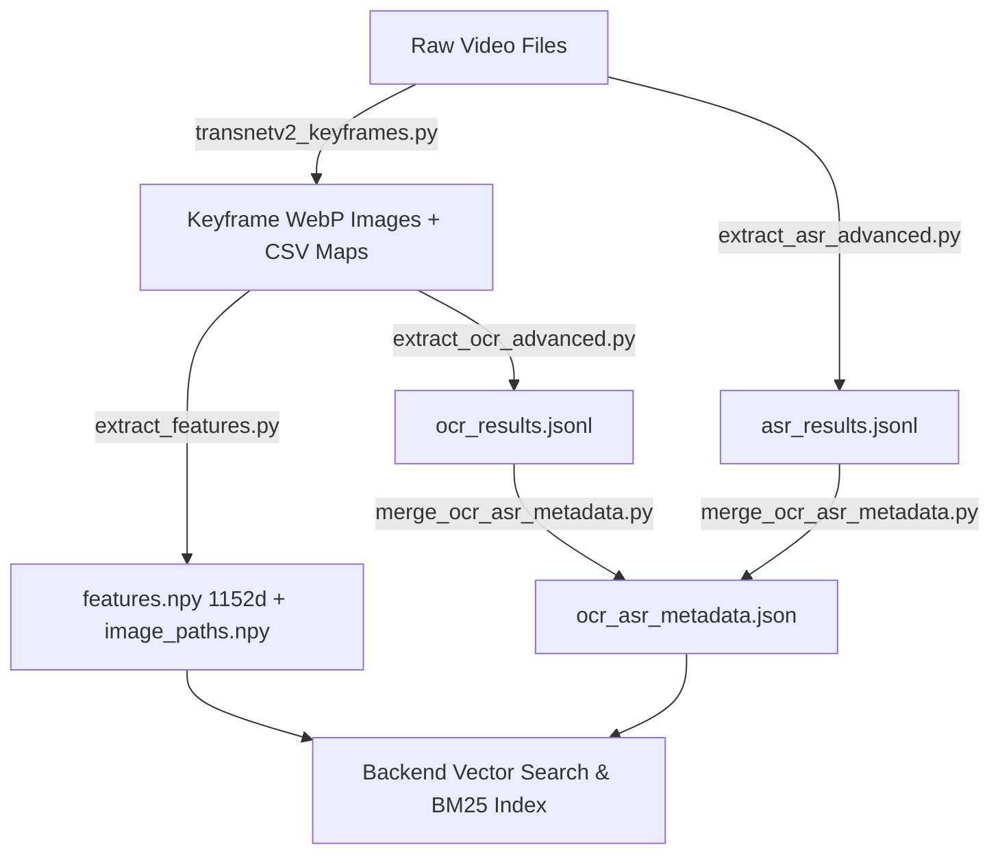

# Data Pipeline — Keyframe Extraction, Multimodal Processing & Feature Encoding

Thư mục chứa toàn bộ quy trình xử lý dữ liệu đầu vào cho hệ thống **AIC Video Retrieval System**.

---

## 🏗️ Kiến Trúc Xử Lý Dữ Liệu (Processing Workflow)



---

## 🛠️ Các Script Chính Trong Pipeline

### 1. Master Pipeline Tự Động: `run_master_offline_pipeline.py`
Chạy tự động toàn bộ 5 bước tuần tự, quản lý giải phóng VRAM qua `cleanup_vram()` (gc + empty_cache) cho GPU 6GB:
```bash
python data_pipeline/run_master_offline_pipeline.py --videos-dir "D:/Videos"
```

### 2. Trích xuất Keyframe Thích Ứng: `transnetv2_keyframes.py`
Sử dụng mô hình deep learning **TransNetV2** để nhận diện biên cảnh, kết hợp bộ lọc mờ Laplacian ($\ge 70.0$ mặc định, cấu hình qua `--dhash-thresh`) và **near-duplicate filtering** (dHash, Hamming ≤ 5, window 4 frames). Xuất keyframe định dạng `.webp` kèm file ánh xạ thời gian `_map.csv`.

```bash
python data_pipeline/transnetv2_keyframes.py --input-folder "D:/Videos" --output-base "./data-keyframes"
```

### 3. Trích xuất Vector Đặc Trưng SigLIP 2 Giant 1152d (Tối ưu FP16): `extract_features.py`
Mã hóa toàn bộ keyframe bằng mô hình **Google SigLIP 2 Giant** (`ViT-gopt-16-SigLIP2-384`) ở chế độ FP16 với bộ nạp ảnh C++ OpenCV WebP Decode, xử lý 14k ảnh chỉ mất **6–8 phút**.

```bash
python data_pipeline/extract_features.py --keyframes-dir ./data-keyframes --batch-size 16
```

### 4. Nhận Diện Chữ Viết OCR Tiếng Việt: `extract_ocr_advanced.py`
**Pipeline 2 giai đoạn tuần tự:** PaddleOCR PP-OCRv4 phát hiện vùng chữ (text detection, `rec=False`) → VietOCR (VGG-Transformer) nhận dạng tiếng Việt từng crop. Tiền xử lý CLAHE tăng tương phản. Cơ chế lọc lặp ticker banner.

_Lý do tách pipeline:_ PaddleOCR recognition gốc không tối ưu cho dấu tiếng Việt (hỏi/ngã, thanh sắc); VietOCR (train trên corpus tiếng Việt lớn) cho CER thấp hơn đáng kể.

```bash
python data_pipeline/extract_ocr_advanced.py --keyframes-dir ./data-keyframes
```

### 5. Nhận Diện Giọng Nói Lời Thoại: `extract_asr_advanced.py`
Bóc tách lời thoại từ track âm thanh video bằng **Faster-Whisper Large-v3-Turbo** (FP16 GPU) với bộ lọc im lặng Silero VAD + heuristic (`no_speech_prob > 0.65`, `avg_logprob < -1.3`, loại hallucination lặp từ). Lưu ý: có thể miss giọng nói bị nhạc đè mạnh.

```bash
python data_pipeline/extract_asr_advanced.py
```

### 6. Hợp Nhất & Đồng Bộ Metadata: `merge_ocr_asr_metadata.py`
Ánh xạ toàn bộ mốc thời gian từ các file `_map.csv` bằng thuật toán nhị phân Bisect để đồng bộ OCR và ASR vào file duy nhất `ocr_asr_metadata.json`.

```bash
python data_pipeline/merge_ocr_asr_metadata.py
```

### 7. Đóng Gói Bài Thi Cuộc Thi: `pack_submission.py`
Script kiểm tra định dạng, tự động sửa lỗi và đóng gói nén `submission.zip` theo format quy định BTC AIC 2026.

```bash
python data_pipeline/pack_submission.py --zip-name submission.zip
```

### 8. Đánh Giá Benchmark: `benchmark_eval.py`
Đo Recall@1/5/10, MRR, WER (ASR), Latency P50/P95 trên tập validation. Cần tạo file `validation_queries.json` với ground-truth queries.

```bash
python data_pipeline/benchmark_eval.py --queries validation_queries.json
```

### 9. Tinh Chỉnh Trọng Số RRF: `tune_rrf_weights.py`
Grid search tối ưu trọng số RRF (`w_visual`, `w_ocr`, `w_asr`) trên tập validation. Chạy khi có ground-truth từ BTC.

```bash
python data_pipeline/tune_rrf_weights.py --queries validation_queries.json
```

### 10. Stress Test VRAM: `stress_test_vram.py`
Test N concurrent WebSocket clients để đo peak VRAM thực tế. Nên chạy trước khi thi thật.

```bash
python data_pipeline/stress_test_vram.py --n-clients 10
```
