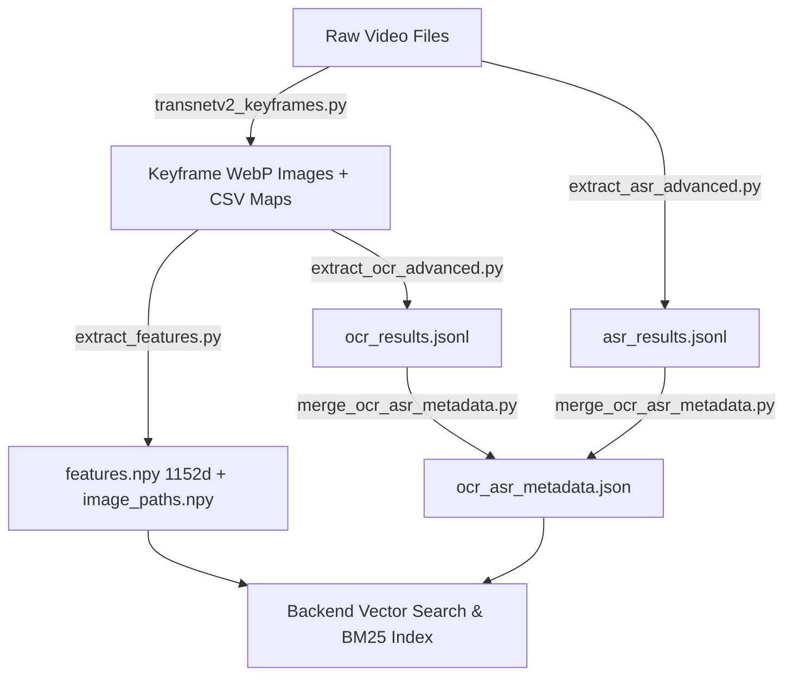

# Data Pipeline — Keyframe Extraction, Multimodal Processing & Feature Encoding

Thư mục chứa toàn bộ quy trình xử lý dữ liệu đầu vào cho hệ thống **AIC Video Retrieval System**.

---

## 🏗️ Kiến Trúc Xử Lý Dữ Liệu (Processing Workflow)



---

## 🛠️ Các Script Chính Trong Pipeline

### 1. Trích xuất Keyframe: `transnetv2_keyframes.py`
Sử dụng mô hình deep learning **TransNetV2** để nhận diện biên cảnh và trích xuất keyframe định dạng `.webp` kèm theo file ánh xạ thời gian `_map.csv`.

```bash
python data_pipeline/transnetv2_keyframes.py --input-folder "D:/Videos" --output-base "./data-keyframes"
```

### 2. Trích xuất Vector Đặc Trưng SigLIP 2 Giant 1152d: `extract_features.py`
Mã hóa toàn bộ keyframe bằng mô hình **Google OpenCLIP `ViT-gopt-16-SigLIP2-384` (Google SigLIP 2 Giant)** thành ma trận vector 1152 chiều lưu vào `features.npy` và `image_paths.npy`.

```bash
python data_pipeline/extract_features.py --keyframes-dir ./data-keyframes --batch-size 16
```

### 3. Nhận Diện Chữ Viết OCR Tiếng Việt: `extract_ocr_advanced.py`
Pipeline đa tiến trình sử dụng **PaddleOCR + VietOCR** với CLAHE contrast enhancement và cơ chế lưu vết tiếp tục (resume).

```bash
python data_pipeline/extract_ocr_advanced.py
```

### 4. Nhận Diện Giọng Nói Lời Thoại: `extract_asr_advanced.py`
Bóc tách lời thoại từ track âm thanh video bằng **Faster-Whisper Large-v3** (FP16 GPU) với bộ lọc im lặng Silero VAD.

```bash
python data_pipeline/extract_asr_advanced.py
```

### 5. Hợp Nhất & Đồng Bộ Metadata: `merge_ocr_asr_metadata.py`
Ánh xạ toàn bộ mốc thời gian từ các file `_map.csv` để đồng bộ 158k nhãn OCR và 144k đoạn lời thoại ASR vào file duy nhất `ocr_asr_metadata.json`.

```bash
python data_pipeline/merge_ocr_asr_metadata.py
```

### 6. Đóng Gói Bài Thi Cuộc Thi: `pack_submission.py`
Script kiểm tra định dạng và đóng gói nén `submission.zip` chuẩn quy định BTC AIC 2026.

```bash
python data_pipeline/pack_submission.py --zip-name submission.zip
```
