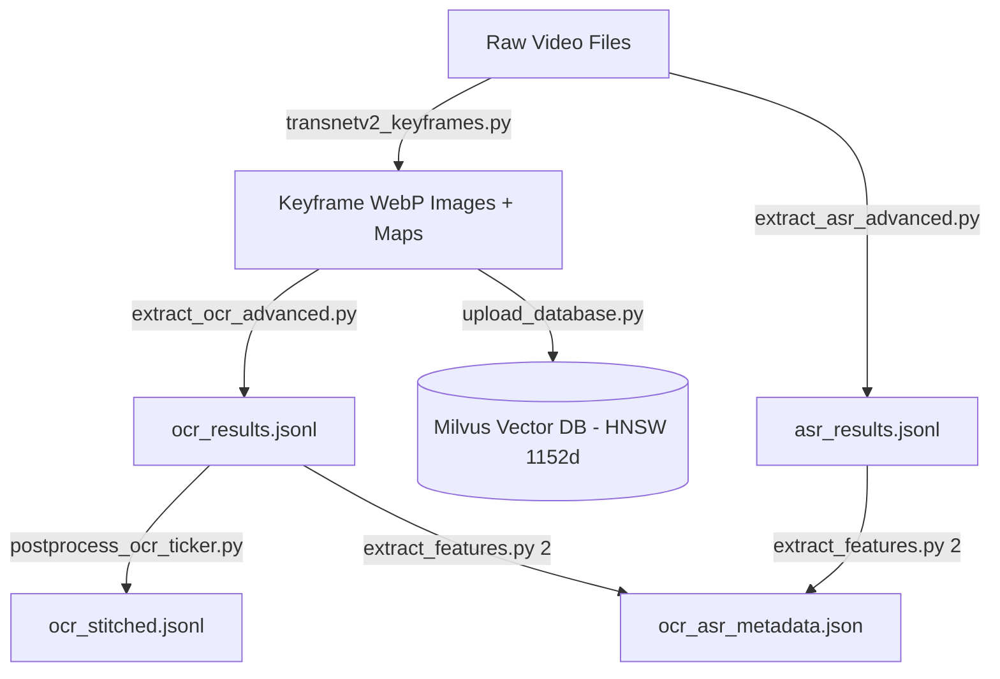

# Data Pipeline — Keyframe Extraction, Multimodal Processing & Milvus Indexing

This folder contains the complete high-performance data processing pipeline for the **AIC Video Retrieval System**.

---

## 🏗️ Architecture & Processing Workflow



---

## 🛠️ Scripts & Utilities

### 1. Keyframe Extraction: `transnetv2_keyframes.py`
Uses the deep learning **TransNetV2** model to perform scene boundary detection and extract keyframe images in compact `.webp` format with frame-to-time CSV maps.

```bash
python data_pipeline/transnetv2_keyframes.py --input-folder "D:/Videos" --output-base "./data-keyframes"
```

### 2. High-Speed Multimodal OCR: `extract_ocr_advanced.py`
Multiprocessed pipeline utilizing **PaddleOCR + VietOCR** with dynamic frame deduplication, CLAHE contrast enhancement, and automatic resume from checkpoint.

```bash
python data_pipeline/extract_ocr_advanced.py
```

### 3. Ticker Text Postprocessing: `postprocess_ocr_ticker.py`
Post-processes OCR output to merge overlapping sliding tickers across continuous frames into complete readable text segments.

```bash
python data_pipeline/postprocess_ocr_ticker.py ocr_results.jsonl ocr_stitched.jsonl
```

### 4. Audio Speech-to-Text: `extract_asr_advanced.py`
Transcribes spoken audio tracks from videos using **Faster-Whisper Large-v3** (float16 on GPU) with Silero VAD silence filtering and automatic resume.

```bash
python data_pipeline/extract_asr_advanced.py
```

### 5. Metadata Aggregator: `extract_features.py`
Merges extracted OCR text and ASR speech transcripts into `ocr_asr_metadata.json` for backend search and hybrid ranking.

```bash
python data_pipeline/extract_features.py 2
```

### 6. Milvus Vector Uploader & HNSW Indexer: `upload_database.py`
Encodes all keyframe images with **Google OpenCLIP SigLIP (`ViT-SO400M-14-SigLIP-384`)** into 1152-dimensional vectors and uploads them to Milvus with a high-speed HNSW index (M=32, efConstruction=250).

```bash
python data_pipeline/upload_database.py --root ./data-keyframes --dimension 1152 --build-index --batch-size 16
```

---

## 🐳 Milvus Vector Database Setup

Start Milvus standalone using Docker Compose:

```bash
# Start Milvus services
docker compose -f data_pipeline/docker-compose.yml up -d

# Check running status
docker compose -f data_pipeline/docker-compose.yml ps
```


