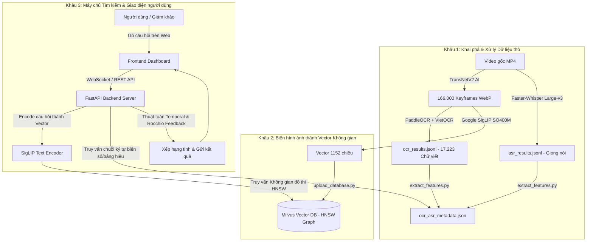

# 🎓 GIÁO TRÌNH TOÀN DIỆN: TỪ CON SỐ 0 ĐẾN KỸ SƯ AI MULTIMODAL & VECTOR SEARCH
## Cẩm nang phân tích kiến trúc hệ thống Video Retrieval System (AIC) và Lộ trình phát triển sự nghiệp AI hiện đại

> **Dành cho:** Người mới bắt đầu, sinh viên công nghệ, lập trình viên muốn chuyển hướng sang AI, và các kỹ sư muốn làm chủ công nghệ Đa phương thức (Multimodal AI) & Cơ sở dữ liệu Vector (Vector Database).

---

## 🌟 PHẦN 1: TỔNG QUAN VÀ BỨC TRANH TOÀN CẢNH (THE BIG PICTURE)

### 1.1. Bài toán Video Retrieval (Truy xuất Video theo ngữ nghĩa) là gì?
Trong thế giới thực tế, dữ liệu video chiếm hơn **80% lưu lượng internet toàn cầu**. Tuy nhiên, máy tính truyền thống chỉ nhìn video như những ma trận pixel (các con số từ 0 đến 255) vô nghĩa. 
- **Cách tìm kiếm cũ:** Dựa vào tên file hoặc tag do con người tự gắn bằng tay (rất tốn công và không bao quát hết nội dung).
- **Cách tìm kiếm hiện đại (Multimodal AI):** Người dùng chỉ cần gõ bất kỳ câu mô tả tự nhiên nào (ví dụ: *"Người phụ nữ mặc áo đầm xanh đang đi bộ dưới mưa trước cửa hàng tiện lợi"*), AI sẽ tự động phân tích hàng trăm ngàn giờ video để tìm ra chính xác từng giây, từng khung hình khớp với câu nói đó.

### 1.2. Sơ đồ tư duy toàn bộ hệ thống code-c-a-Long:

---

## 🧠 PHẦN 2: BÓC TÁCH KỸ THUẬT TỪNG MÔ ĐUN CỐT LÕI (TECHNICAL DEEP DIVE)

Để hiểu sâu hệ thống này, bạn cần nắm vững 5 trụ cột công nghệ sau:

### 1. Trụ cột 1: Trích xuất Khung hình đại diện (Keyframe Extraction via TransNetV2)
- **Vấn đề:** 1 video 20 phút có tốc độ 25 khung hình/giây (FPS) chứa tới 20 x 60 x 25 = 30.000 ảnh. Nếu xử lý từng ảnh, máy sẽ bị quá tải bộ nhớ và tính toán rất lâu.
- **Giải pháp AI:** Mô hình Deep Learning TransNetV2 (sử dụng 3D-CNN và Dilated Convolution) tự động phân tích sự biến đổi của các pixel theo trục thời gian để tìm ranh giới chuyển cảnh (Shot Transition). AI sẽ chỉ giữ lại 1 tấm ảnh tiêu biểu nhất cho mỗi cảnh quay.
- **Kết quả:** Từ 30.000 ảnh giảm xuống chỉ còn khoảng 150 - 300 keyframes nén định dạng .webp, giúp giảm 99% dung lượng mà vẫn giữ nguyên 100% nội dung quan trọng.

### 2. Trụ cột 2: Học tương phản Đa phương thức (Multimodal Contrastive Learning - OpenCLIP & SigLIP)
- **Bản chất của OpenCLIP / Google SigLIP (ViT-SO400M-14-SigLIP-384):**
  - Mô hình gồm 2 nhánh (Dual-Tower Network): **Image Encoder** (Thị giác - Vision Transformer) và **Text Encoder** (Ngôn ngữ).
  - Cả 2 nhánh được huấn luyện bằng phương pháp **Contrastive Learning**: Kéo vector của ảnh và vector của câu mô tả khớp với ảnh đó lại gần nhau trong không gian 1152 chiều, đồng thời đẩy xa các cặp không liên quan.
  - Khi người dùng gõ câu tìm kiếm, Text Encoder biến câu chữ thành 1 vector 1152 chiều. Khoảng cách góc (Cosine Similarity) giữa vector câu hỏi và vector ảnh càng gần 1 thì ảnh đó càng khớp với mô tả.

### 3. Trụ cột 3: Nhận diện Chữ viết Tiếng Việt (OCR - Optical Character Recognition)
- **Kiến trúc kết hợp 2 tầng (Two-Stage Pipeline):**
  1. **PaddleOCR (DBNet):** Chuyên quét phát hiện vị trí các hộp chữ (Bounding Boxes) trên ảnh với tốc độ cực cao.
  2. **VietOCR (VGG + Transformer Sequence-to-Sequence):** Đọc chữ bên trong hộp đã cắt, chuyên trị các dấu thanh tiếng Việt phức tạp (sắc, huyền, hỏi, ngã, nặng, đ, ư, ơ...).
- **Kỹ thuật tối ưu hóa:** CLAHE (Tăng tương phản cục bộ chống lóa đèn/thiếu sáng) và Heuristic Deduplication (bỏ qua chữ trùng lặp giữa các frame liên tiếp).

### 4. Trụ cột 4: Nhận diện Giọng nói Tiếng Việt (ASR - Automatic Speech Recognition)
- **Mô hình Faster-Whisper Large-v3:**
  - Kiến trúc Encoder-Decoder Transformer xử lý phổ âm thanh Mel-Spectrogram 80 kênh.
  - Tích hợp **Silero VAD (Voice Activity Detector)**: Cắt bỏ 100% các đoạn im lặng/tiếng gió để chỉ giải mã khi có tiếng người nói.
  - **Tối ưu hóa phần cứng:** Kỹ thuật lượng tử hóa int8_float16 trên nhân NVIDIA Tensor Cores giúp tăng tốc gấp gần 3 lần và tiết kiệm VRAM.

### 5. Trụ cột 5: Cơ sở dữ liệu Vector & Đồ thị HNSW (Milvus Vector Database)
- **Tại sao không dùng SQL truyền thống?** SQL chỉ tìm kiếm so khớp chính xác (WHERE id = 5). Không thể dùng SQL để tìm "vector nào gần với vector này nhất trong không gian 1152 chiều giữa 166.000 điểm".
- **Thuật toán HNSW (Hierarchical Navigable Small World):**
  - Xây dựng đồ thị mạng lưới đa tầng tương tự mạng xã hội (Hiện tượng 6 bậc cách biệt - Six Degrees of Separation).
  - Cho phép tìm kiếm láng giềng gần nhất (Approximate Nearest Neighbors - ANN) với độ phức tạp O(log N) chỉ trong vài **mili-giây** thay vì phải tính toán tuần tự toàn bộ database.

---

## 🗺️ PHẦN 3: LỘ TRÌNH HỌC TẬP TỪ CON SỐ 0 ĐẾN KỸ SƯ AI (ZERO TO HERO)

Nếu bạn muốn làm chủ toàn bộ kiến thức để tự tay xây dựng những hệ thống đẳng cấp như thế này, hãy đi theo 5 giai đoạn:

### 📍 Giai đoạn 1: Nền tảng Lập trình & Toán học cho AI (1 - 2 tháng)
- **Python chuyên sâu:** OOP (Lập trình hướng đối tượng), Generator, Decorator, `multiprocessing`, `asyncio`, `typing`, `pathlib`.
- **Thao tác dữ liệu số:** `numpy` (Các phép toán Ma trận & Vector), `pandas` (Xử lý bảng biểu), `opencv-python` & `Pillow` (Xử lý ảnh/video).
- **Toán học ứng dụng:**
  - *Đại số tuyến tính (Linear Algebra):* Ma trận, Vector, Tích vô hướng (Dot Product), Cosine Similarity, Chuẩn hóa (Normalization).
  - *Giải tích (Calculus):* Đạo hàm, Gradient Descent, Lan truyền ngược (Backpropagation).
  - *Xác suất & Thống kê:* Phân phối xác suất, Định lý Bayes, Hàm Softmax, Cross-Entropy Loss.

### 📍 Giai đoạn 2: Deep Learning & Framework PyTorch (2 - 3 tháng)
- **Cốt lõi:** Hiểu cách xây dựng Mạng nơ-ron (Perceptron, Multi-Layer Perceptron, Activation Functions như ReLU, GELU, Sigmoid).
- **PyTorch thành thạo:** `torch.Tensor`, `nn.Module`, `Dataset`, `DataLoader`, `Optimizer`, `Loss Functions`, `torch.amp.autocast` (Kỹ thuật Mixed Precision FP16).
- **Kiến trúc kinh điển:**
  - **CNN (Convolutional Neural Networks):** ResNet, EfficientNet, 3D-CNN (cho xử lý video).
  - **Transformer Architecture (Vua của AI hiện đại):** Self-Attention, Multi-Head Attention, Positional Encoding, Vision Transformer (ViT).

### 📍 Giai đoạn 3: Chuyên sâu Thị giác máy tính & Xử lý ngôn ngữ (3 tháng)
- **Computer Vision (CV):** Object Detection (YOLO), Semantic Segmentation, Video Shot Detection (TransNetV2), Image Embeddings (DINOv2).
- **Natural Language Processing (NLP):** Tokenizer (BPE, WordPiece), BERT, GPT, Sentence-Transformers (BGE-M3), BM25 Ranking.
- **Optical Character Recognition (OCR) & Speech (ASR):** CRNN, CTC Loss, Connectionist Temporal Classification, Whisper.

### 📍 Giai đoạn 4: Multimodal AI, RAG & Vector Database (2 tháng)
- **Multimodal Alignment:** CLIP, SigLIP, BLIP, EVA-CLIP, LLaVA (Vision-Language Models - VLM).
- **Vector Search Engine:** Milvus, Qdrant, Faiss, ChromaDB. Tìm hiểu sâu thuật toán HNSW, IVF-PQ, Scalar Quantization.
- **Kỹ thuật tìm kiếm nâng cao:**
  - **Rocchio Relevance Feedback:** Thuật toán học tương tác từ phản hồi của người dùng để uốn nắn vector tìm kiếm.
  - **Temporal Alignment:** Thuật toán suy luận chuỗi thời gian cho sự kiện video (First query -> Next query).
  - **HippoRAG / Graph Memory:** Mô phỏng vùng hải mã não bộ để duy trì ngữ cảnh hội thoại đa lượt không bị ảo giác.

### 📍 Giai đoạn 5: Kỹ thuật Hệ thống & Tối ưu hóa Triển khai (Production Engineering)
- **Backend hiệu năng cao:** FastAPI (Async Endpoints, WebSockets, Streaming Responses), Uvicorn, Gunicorn.
- **DevOps & Container:** Docker, Docker Compose, Nginx Proxy.
- **Tối ưu hóa suy luận (Inference Optimization):** ONNX Runtime, TensorRT, CTranslate2, vLLM, Quantization (INT8, FP16, AWQ).

---

## 📚 PHẦN 4: KHO TÀI NGUYÊN & NGUỒN TÀI LIỆU CHUẨN QUỐC TẾ

### 1. Các khóa học xuất sắc nhất thế giới (Miễn phí & Chất lượng cao):
1. **Stanford CS231n:** *Deep Learning for Computer Vision* (Cực kỳ hay về CNN, Vision Transformer và Image Understanding).
2. **Stanford CS224n:** *Natural Language Processing with Deep Learning* (Chuẩn mực về NLP và Transformer).
3. **Fast.ai (Practical Deep Learning for Coders):** Khóa học thực chiến giúp bạn lập trình ra sản phẩm AI ngay từ những buổi đầu.
4. **DeepLearning.AI (Andrew Ng):** Các chứng chỉ *Deep Learning Specialization* và các khóa ngắn về *Vector Databases & Multimodal Retrieval*.
5. **Hugging Face Audio & NLP Courses:** Khóa học thực hành miễn phí về Whisper, Transformers và Embeddings.

### 2. Sách gối đầu giường:
- 📖 **Deep Learning with PyTorch** — *Eli Stevens, Luca Antiga, Thomas Viehmann* (Sách chính thống hay nhất về PyTorch).
- 📖 **Designing Data-Intensive Applications** — *Martin Kleppmann* (Kinh thánh về thiết kế hệ thống dữ liệu lớn và kiến trúc phân tán).
- 📖 **Speech and Language Processing** — *Dan Jurafsky & James H. Martin* (Cuốn sách toàn diện nhất về Xử lý ngôn ngữ và Tiếng nói).

### 3. Các bài báo khoa học (Papers) tạo nên cuộc cách mạng cần đọc:
1. **Transformer:** *"Attention Is All You Need"* (Vaswani et al., 2017)
2. **CLIP:** *"Learning Transferable Visual Models From Natural Language Supervision"* (Radford et al., OpenAI 2021)
3. **SigLIP:** *"Sigmoid Loss for Language Image Pre-Training"* (Zhai et al., Google 2023)
4. **Whisper:** *"Robust Speech Recognition via Large-Scale Weak Supervision"* (Radford et al., OpenAI 2022)
5. **HNSW:** *"Efficient and robust approximate nearest neighbor search using Hierarchical Navigable Small World graphs"* (Malkov & Yashunin, 2018)

### 4. Kênh Youtube & Blog uy tín để cập nhật kiến thức mỗi tuần:
- 📺 **3Blue1Brown:** Trực quan hóa toán học và Neural Networks bằng hình học đẹp nhất hành tinh.
- 📺 **Yannic Kilcher:** Phân tích chi tiết từng bài báo khoa học AI mới nhất hàng tuần.
- 📺 **StatQuest with Josh Starmer:** Giải thích các thuật toán AI phức tạp thành ngôn ngữ cực kỳ dễ hiểu.
- 📝 **Jay Alammar Blog:** Các bài viết minh họa bằng hình động nổi tiếng (*The Illustrated Transformer, The Illustrated Word2Vec*).
- 📝 **Lilian Weng (Head of Safety at OpenAI):** Blog chuyên khảo cực sâu về Prompt Engineering, Diffusion Models và Vector Search.

---

## 💼 PHẦN 5: LỜI KHUYÊN PHÁT TRIỂN SỰ NGHIỆP CHO KỸ SƯ AI (CAREER ADVICE)

1. **Đừng chỉ "học vẹt" lý thuyết — Hãy xây dựng sản phẩm thực tế (Build in Public):**
   - Đọc 10 bài báo không bằng tự tay viết 1 script nạp dữ liệu vào Milvus và chạy 1 API FastAPI như dự án này.
   - Hãy đưa code lên GitHub, viết README chỉn chu, có sơ đồ Mermaid và video demo sản phẩm. Đó là tấm vé thông hành tốt nhất khi đi xin việc.
2. **Luyện tư duy Tối ưu hóa Phần cứng & Hệ thống (System Engineering Mindset):**
   - AI giỏi không chỉ là người biết gọi hàm model.predict(), mà là người biết: Làm sao để model 4GB chạy mượt trên GPU 6GB mà không bị tràn RAM? Làm sao để tăng tốc xử lý từ 268s xuống 101s? Đó chính là giá trị tạo nên sự khác biệt giữa kỹ sư cao cấp và người mới.
3. **Tham gia các cuộc thi công nghệ (Kaggle, AIC, VQA Challenges):**
   - Áp lực thời gian và dữ liệu thực tế tại các cuộc thi sẽ rèn luyện cho bạn bản lĩnh xử lý lỗi, tư duy tối ưu pipeline và làm việc nhóm hiệu quả nhất.

---
*Tài liệu được biên soạn độc quyền bởi Chuyên gia AI Antigravity dành cho dự án Video Retrieval System (AIC).*
